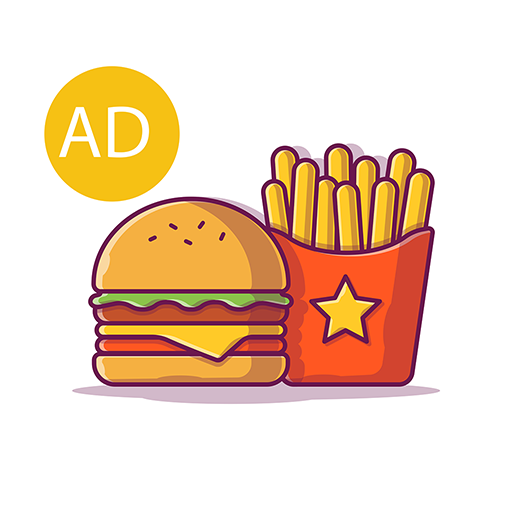
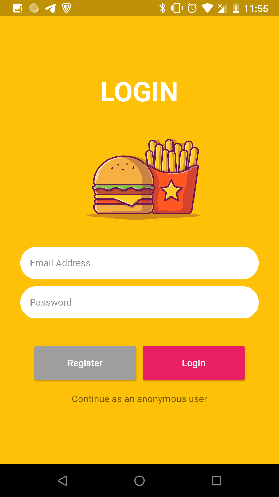
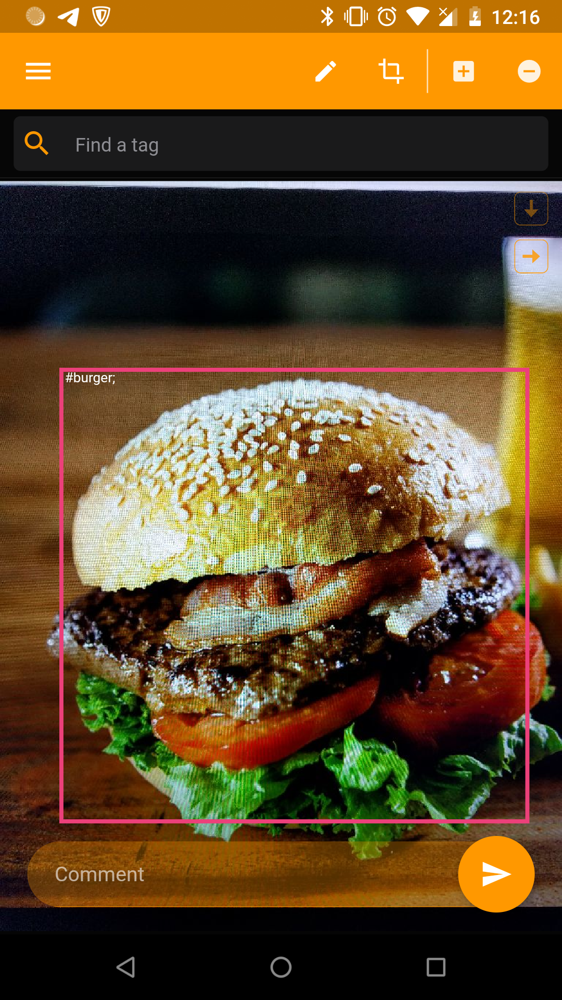
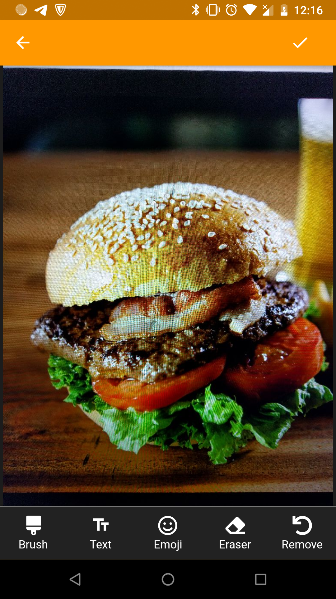
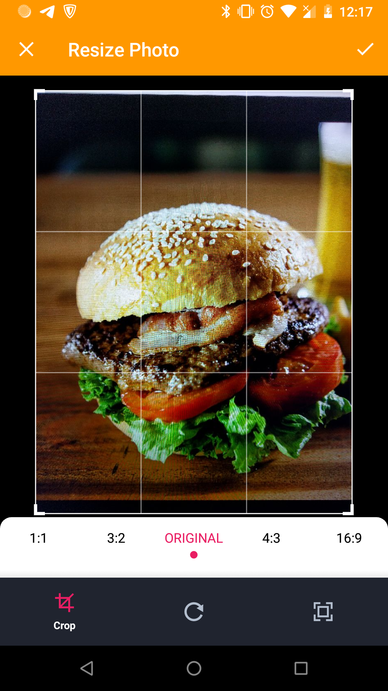

# Annotation App

An annotation/image collector mobile app

## Getting Started

This app is a prototype written in Flutter. Users can take pictures of food, tag them, and send those to 
the server. Those images can be used to train an AI model.

In this application, I used Pybossa as a server to collect tagged images from users.

Some demo images:

